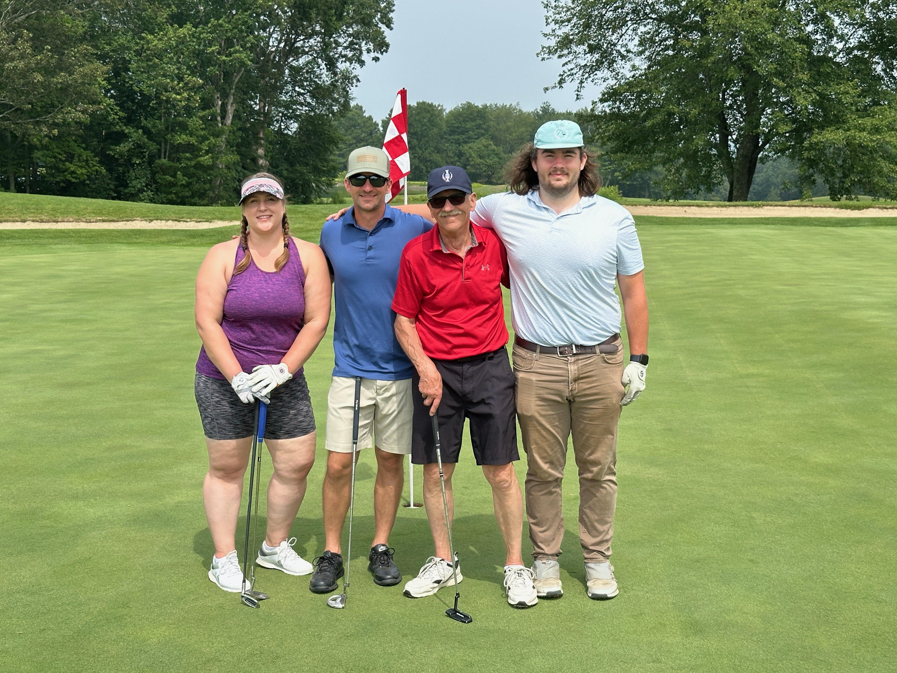

<!DOCTYPE html>
<html lang="en">
<head>
    <meta charset="UTF-8">
    <meta name="viewport" content="width=device-width, initial-scale=1.0">
    <link rel="stylesheet" href="https://cdnjs.cloudflare.com/ajax/libs/font-awesome/6.4.0/css/all.min.css">
    <title>Portfolio - stepankiw.com</title>
    
</head>
<body>
    <!-- Navigation -->
    <nav>
        

            
Portfolio

            <ul>
                <li><a href="#about">About</a></li>
                <li><a href="#experience">Experience</a></li>
                <li><a href="#projects">Projects</a></li>
                <li><a href="#" id="contactBtn">Contact</a></li>
            </ul>
        

    </nav>

    <!-- About Section -->
    <section id="about">
        

            

                <h1>Hi, I'm Cooper Stepankiw </h1>
                
Welcome to my portfolio! I am starting my final semester of Computer Science at the University of Maine, and I am looking into continue my career within the Data and Analytics field.

                
For over 2 years, I have been working IT for Bangor Savings Bank in Bangor Maine, along with being a full time student who has worked on multiple projects.

                
I have found a real passion for solving problems and creating innovative solutions, and I hope to continue my journey with a company who can help me grow.

                

                    <h3>Things I Love</h3>
                    

                        Baseball (Specifically, the Mets)
                        Weightlifting
                         Golfing
                         Music
                        Squash (No, not the vegetable)
                        Caffiene
                    

                

            

            

                

                

                

                

            

        

    </section>

    <!-- Experience Section -->
    <section id="experience">
    <h2 class="section-title">Work Experience</h2>
    
    

        

            

            
🏦

            <h3>IT Customer Support Representative</h3>
            
Bangor Savings Bank

            
Nov 2023 - Present

            
Bangor, Maine

            <ul class="experience-list">
                <li>Provided front-line technical support via phone, ticketing system, and walk-ups for over 1,200 employees</li>
                <li>Configured, deployed, and maintained Windows workstations and peripherals across multiple departments</li>
                <li>Managed and administered user access across 40+ critical banking and enterprise applications</li>
                <li>Balanced a workload of 25–30 hours per week while maintaining high service quality and quick resolution times</li>
            </ul>
            

                Microsoft 365
                Windows Administration
                User Access Management
                Ticketing Systems
            

        

        

            

            
📊

            <h3>CX Data Analyst Intern</h3>
            
Bangor Savings Bank

            
May 2025 - Aug 2025

            
Bangor, Maine

            <ul class="experience-list">
                <li>Consolidated and cleaned data from multiple systems to create a unified access point for CX materials</li>
                <li>Designed and implemented prompt-based reporting tools to streamline bankwide data searches and insights</li>
                <li>Built a comprehensive CX catalog to enhance data discoverability and empower self-service analytics for employees</li>
            </ul>
            

                Data Analysis
                IBM Cognos
                Microsoft VBA
                Data Centralization
            

        

        

            

            
🔧

            <h3>Maintenance Assistant</h3>
            
Canterbury School

            
2021 - 2023

            
New Milford, Connecticut

            <ul class="experience-list">
                <li>Worked 40-hour workweeks during summer vacations and long breaks</li>
                <li>Assembled, replaced, and dismantled equipment for various events</li>
                <li>Gained experience working for a private institution, both on individual and team projects</li>
            </ul>
            

                Facility Maintenance
                Team Collaboration
                Project Coordination
            

        

    

    </section>

    <!-- Projects Section -->
    <section id="projects">
    

        Featured Work
    

    <h2 class="section-title">Projects</h2>
    
    

        

            
🏥

            

                <h3>3D Medical CT-Scan Printing Web App</h3>
                
Computer Science Capstone | University of Maine

                
2025 - 2026

                
Built a local browser-based web app that converts DICOM CT scans into 3D models and exportable STL/G-code files for 3D printing. Implemented client-side 3D visualization and applied the Marching Cubes algorithm for anatomical surface reconstruction.

                

                    TypeScript
                    DICOM
                    VTK.js
                    STL
                    Git
                

            

        

        

            
📰

            

                <h3>Black Bear Bulletin</h3>
                
Software Engineering | University of Maine

                
Spring 2025

                
Developed a responsive web application that centralizes UMaine sports scores, schedules, and news into a customizable user dashboard. Implemented live score updates and personalized widgets using Firebase for real-time data and React.js for dynamic UI components. Integrated external data sources such as NCAA and UMaine Athletics APIs.

                

                    React.js
                    Node.js
                    Firebase
                    REST APIs
                    Git
                

            

        

        

            
🤠

            

                <h3>Wild West Forum</h3>
                
Server-Sided Web Development | University of Maine

                
Fall 2025

                
Developed a secure full-stack forum with Node.js and Express featuring persistent SQLite3 storage, Argon2 authentication, and session management. Implemented real-time chat with Socket.io, nested comments with voting and pagination, customizable user profiles, and password recovery workflows with token-based email verification.

                

                    Node.js
                    Express
                    SQLite3
                    Socket.io
                    Argon2
                    Handlebars
                    Git
                

            

        

    

    </section>

    <!-- Footer -->
    <footer>
    

        <h3>Let's Connect</h3>
        
I'm always open to new opportunities and collaborations.

        
        

            <a href="https://github.com/Coostep" target="_blank" title="GitHub">
                <i class="fab fa-github"></i>
            </a>
            <a href="https://linkedin.com/in/cooperstepankiw" target="_blank" title="LinkedIn">
                <i class="fab fa-linkedin"></i>
            </a>
            <a href="mailto:your-email@example.com" title="Email">
                <i class="fas fa-envelope"></i>
            </a>
        

        
        
&copy; 2026 - Stepankiw.com - Cooper Stepankiw

    

    </footer>

    <!-- Contact Modal -->
    

        

            <button class="close-btn" id="closeBtn">&times;</button>
            <h3>Get In Touch</h3>
            
            

                <strong>Location</strong>
                New Milford, Connecticut
            

            
            

                <strong>E-mail</strong>
                cstepnq11@gmail.com
            

            
            

                <strong>Carrier Pigeon</strong>
                I would be impressed if this happened
            

        

    

    
</body>
</html>
